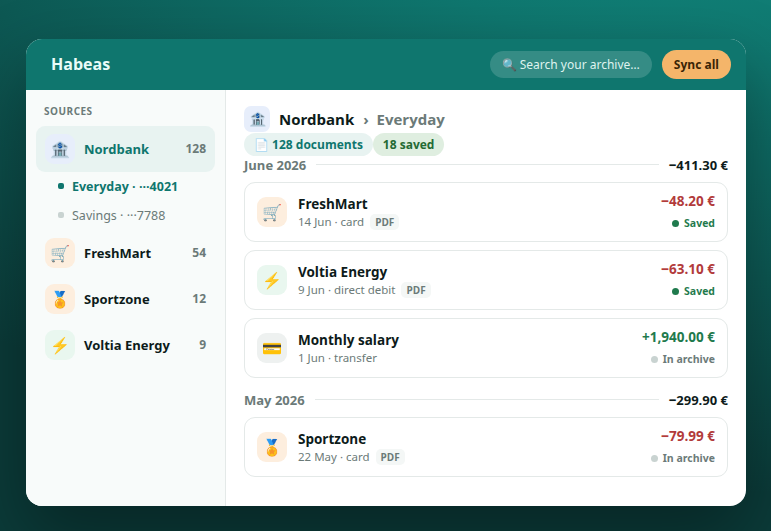

# Habeas

> *Habeas data* — making your right to your own data executable.

[](https://chromewebstore.google.com/detail/pbpehhngeidokhaokgloaneiibhceiog)
[](https://addons.mozilla.org/firefox/addon/habeas/)
[](LICENSE)

**Habeas** is an open-source, local-first browser extension that retrieves **your own invoices, receipts and bank statements** from websites that offer no API, no bulk export, or intentionally make automation difficult.

It runs **inside your own authenticated browser session**, where you already have access to your data, and delivers that data wherever **you** choose.

Unlike server-side aggregators, Habeas never asks for your credentials, never logs in on your behalf, and never receives your personal data.

**And if your provider already emails you the invoice, you do not need Habeas.** That is why the catalogue
is not a land grab: a service that already hands you your data gets no source, on purpose. Habeas is for
the ones that keep it behind a login and let it expire there.



*Your archive, after a few syncs. Service names above are fictitious.*

---

## Why Habeas exists

Many websites already contain your personal data:

- receipts
- invoices
- bank statements
- investment reports
- tax documents
- transaction history

In theory, that data belongs to you.

In practice, many providers make large-scale export difficult:

- no API;
- no email export;
- aggressive anti-bot protection;
- short document retention periods.

Habeas exists to bridge that gap.

It doesn't create new rights.

It simply makes existing ones practical.

---

# How it works

Habeas runs entirely inside your browser.

You authenticate yourself exactly as you normally would.

Once authenticated, Habeas can retrieve your own documents and structured data without ever sending your credentials to anyone else.

```
Websites (Sources)
        │
        ▼
      Habeas
  (local runtime)
        │
        ▼
Destinations (Sinks)

Folder • Downloads • Google Drive • HTTP • WebDAV • S3 • Dropbox • Your applications
```

Everything happens locally.

No remote login.

No stored logins — you sign in to each site yourself.

No cloud scraper.

---

# Sources and Sinks

Habeas separates **where data comes from** from **where data goes**.

## Sources

A Source knows how to retrieve data from one specific website.

**21 verified Sources are published today** — each one built and tested against a real capture of the
service. Most are Spanish (where the project started), plus international ones including **Revolut,
Amazon, PayPal, Trade Republic, AliExpress, Raisin and Hover**.

A further 3 are published as **experimental**: drafted but never confirmed against a real account. The
catalogue flags them, and the extension hides them unless you ask for them.

Browse the whole catalogue — every definition is public and reviewable — at
**[habeas.dev/sources.html](https://habeas.dev/sources.html)**, or read the per-service guides at
**[habeas.dev/download/](https://habeas.dev/download/)**.

They cover supermarkets, retail, banks, brokers, utilities and online services.

Each Source produces its own native outputs.

Depending on the service, those outputs may include:

- PDFs
- spreadsheets
- structured JSON
- images
- other provider-specific formats

Habeas deliberately does **not** convert or normalize these documents.

The provider's data remains exactly as produced.

---

## Sinks

A Sink decides where retrieved data goes.

Current sinks include:

- Downloads
- Local folders
- Google Drive
- HTTP endpoints
- WebDAV servers
- S3 and S3-compatible storage (MinIO, Cloudflare R2, Backblaze B2)
- Dropbox

Applications can also integrate with Habeas to receive user-authorized data without implementing provider-specific authentication and extraction logic. See the developer guide: **[docs/INTEGRATION.md](docs/INTEGRATION.md)**.

---

# One interface, native data

Habeas standardizes **access**, not **documents**.

Every Source may expose different outputs.

What remains consistent is the way Sources and Sinks communicate.

Applications integrate once with Habeas instead of once per provider.

---

# Growing the ecosystem

Sources are independent from the runtime.

Adding support for a new website does not require changing Habeas itself.

To make this scalable, Habeas includes a **session recorder** that helps infer new Source definitions from real browsing sessions.

The typical workflow is:

1. Perform the normal workflow on a website.
2. Record the session.
3. Review the inferred Source definition.
4. Refine it if necessary.
5. Optionally contribute it back to the community.

The goal is to make supporting new websites increasingly community-driven.

---

# Why local-first matters

The architecture is deliberate.

Unlike traditional aggregators:

- you log in yourself;
- MFA remains unchanged;
- your site logins never leave your browser;
- Habeas operates no aggregation servers;
- your data goes only where you choose.

The browser is already trusted by the website.

Habeas simply runs there.

---

# Current status

**Public beta — published on both stores.**

Habeas is live on the [Chrome Web Store](https://chromewebstore.google.com/detail/pbpehhngeidokhaokgloaneiibhceiog)
and [Firefox Add-ons](https://addons.mozilla.org/firefox/addon/habeas/).

The project already includes:

- a Manifest V3 extension;
- Chrome/Chromium support;
- Firefox support;
- **21 verified Sources** (supermarkets, retail, utilities, banks, brokers) plus 3 experimental, and growing;
- multiple Sinks (download / local folder / native Google Drive / HTTP / WebDAV / S3 / Dropbox);
- automatic synchronization on login, plus a "Sync all" sweep across every source;
- duplicate detection;
- a cross-source "Documents" browser of everything recovered;
- a community Sources catalog with in-extension record mode, authoring, and sharing;
- multilingual interface (English + Spanish).

The architecture is stable, but the catalog of supported Sources continues to grow.

---

# Installation

## From your browser's store (recommended)

- **Chrome / Chromium** (Chrome, Edge, Brave, Opera…): [Chrome Web Store](https://chromewebstore.google.com/detail/pbpehhngeidokhaokgloaneiibhceiog)
- **Firefox** (128 or newer): [Firefox Add-ons](https://addons.mozilla.org/firefox/addon/habeas/)

Prebuilt MV3 zips for each release are also attached to the [GitHub Releases](https://github.com/habeas-dev/habeas/releases).

## Development / unpacked build

Load the extension straight from the source tree while hacking on it:

**Chrome / Chromium**

1. Open `chrome://extensions`
2. Enable **Developer Mode**
3. Select **Load unpacked**
4. Choose the `extension/` directory

**Firefox**

1. Open `about:debugging`
2. Choose **This Firefox**
3. Select **Load Temporary Add-on**
4. Open `extension/manifest.json`

Or build the packaged zip yourself with `npm install && npm run package` (output in `dist/`).

---

# Contributing

There are many ways to contribute:

- create new Source definitions — **three ways**, from no-code to advanced: see
  [docs/ADDING-SOURCES.md](docs/ADDING-SOURCES.md)
  (🔒 local · 🤝 [assisted](docs/ASSISTED-AUTHORING.md) · 🛠️ [advanced AI + proxy](docs/AUTHORING-SOURCES.md));
- improve existing Sources;
- develop new Sinks;
- improve documentation;
- report bugs;
- improve translations.

Contributions of all sizes are welcome. See [CONTRIBUTING.md](CONTRIBUTING.md).

**Using an AI coding assistant?** Start at **[AGENTS.md](AGENTS.md)** — the vendor-neutral onboarding for
Codex, Cursor, Aider, Gemini CLI, etc. (Claude Code additionally reads [CLAUDE.md](CLAUDE.md) automatically).

---

# Legal

Habeas is designed to help users exercise their own data rights.

It operates entirely within the user's authenticated browser session.

It never stores the credentials you use to log in — you sign in yourself, in your own session. (The optional
**Credentials Vault** stores only your **destination** access — a Dropbox/S3 token, an HTTP endpoint's key —
encrypted under a passphrase only you hold, so you can reuse your *sinks* across browsers; it never touches
your login to any source.)

It never performs remote logins.

It never attempts to bypass authentication or MFA.

However, some websites may prohibit automated access in their Terms of Service, even when accessing your own account.

Using Habeas remains your own responsibility.

Nothing in this project constitutes legal advice.

---

# License

AGPL-3.0-or-later
